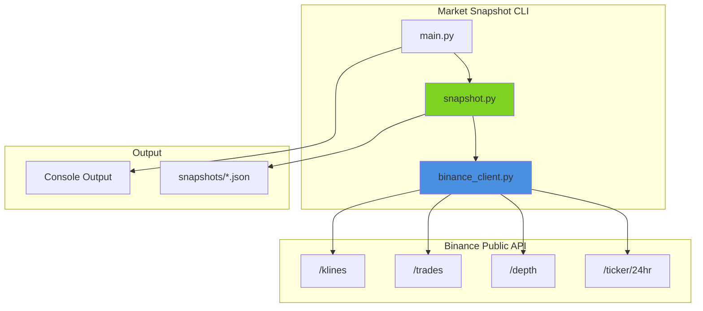

# RATU REST API


Comprehensive market analytics using Binance public REST API. No authentication required.

> 🔗 **Part of the RATUProject** | Real-time Automated Trading Unified  
> **System Prototyping Focus**: REST API integration with dataclass-based response parsing and market analytics

## Features

| Feature | Description |
|---------|-------------|
| **Market Snapshot** | Comprehensive analytics for any trading pair |
| **Price Data** | Current price, 24h statistics, weighted average |
| **Order Book** | Depth analysis with bid/ask ratios |
| **Trade Analysis** | Recent trades with buy/sell breakdown |
| **Multi-Timeframe** | Kline data for 1h, 4h, 1d intervals |
| **No Auth Required** | Uses only public endpoints |

## Usage

```bash
# Sync dependencies
uv sync

# Create comprehensive market snapshot (saves to snapshots/)
uv run market-snapshot ETHUSDT

# Show basic market info only (no file saved)
uv run market-snapshot ETHUSDT info

# Other pairs
uv run market-snapshot BTCUSDT
uv run market-snapshot SOLUSDT
```

### Sample Output - Snapshot

```
================================================================================
  MARKET SNAPSHOT - ETHUSDT
================================================================================
  Symbol: ETHUSDT
  Price: $3,890.45
  24h Change: +45.20 (+1.18%)
  24h Range: $3,820.00 - $3,950.00
  24h Volume: 245,000.00 ETH
  24h Quote Volume: $952,000,000.00
  24h Trades: 1,250,000

  Order Book Depth (top 20 levels):
    Total Bid Depth: 125.5000
    Total Ask Depth: 118.2000
    Bid/Ask Ratio: 1.06

  Recent Trade Analysis (last 100):
    Buy Trades: 52 (52.0%)
    Sell Trades: 48 (48.0%)
    Buy/Sell Ratio: 1.08
    Avg Trade Size: 0.4500

  Spread: $0.0100 (0.0003%)

  Snapshot saved to: snapshots/ethusdt_*.json
```

### Sample Snapshot JSON

```json
{
  "timestamp": "2025-12-12T17:00:00.000000",
  "symbol": "ETHUSDT",
  "summary": {
    "price": 3890.45,
    "price_change_24h": 45.20,
    "price_change_percent_24h": 1.18,
    "volume_24h": 245000.0,
    "trade_count_24h": 1250000
  },
  "depth_analysis": {
    "total_bid_depth": 125.5,
    "total_ask_depth": 118.2,
    "bid_ask_ratio": 1.06
  },
  "trade_analysis": {
    "buy_trades": 52,
    "sell_trades": 48,
    "buy_sell_ratio": 1.08
  }
}
```

## System Overview



## API Endpoints Used

All endpoints are public and require no authentication:

| Endpoint | Description |
|----------|-------------|
| `/api/v3/ticker/price` | Current price |
| `/api/v3/ticker/24hr` | 24-hour statistics |
| `/api/v3/depth` | Order book depth |
| `/api/v3/trades` | Recent trades |
| `/api/v3/klines` | Candlestick data |
| `/api/v3/avgPrice` | 5-minute average price |
| `/api/v3/ticker/bookTicker` | Best bid/ask |

## Project Structure

```
ratu-rest-api/
  src/rest_api/
    __init__.py
    config.py           # API settings
    binance_client.py   # REST API client
    snapshot.py         # Market analytics
    main.py             # CLI entry point
  tests/
  snapshots/            # Output directory
```

## Design Decisions

| Decision | Rationale |
|----------|-----------|
| httpx | Connection pooling for multiple API calls |
| Dataclasses | Type-safe response parsing |
| No auth | Public endpoints only, no API key needed |
| Multi-timeframe | 1h, 4h, 1d klines for trend analysis |

## Notable Code

This repository demonstrates prototyping-focused REST API integration patterns. See [NOTABLE_CODE.md](NOTABLE_CODE.md) for detailed code examples highlighting:

- Multi-endpoint integration
- Dataclass-based response parsing
- Multi-timeframe analysis

## License

This project is licensed under the MIT License - see the [LICENSE](LICENSE) file for details.

## Author

**Adityo Nugroho**  
- Portfolio: https://adityonugrohoid.github.io  
- GitHub: https://github.com/adityonugrohoid  
- LinkedIn: https://www.linkedin.com/in/adityonugrohoid/
