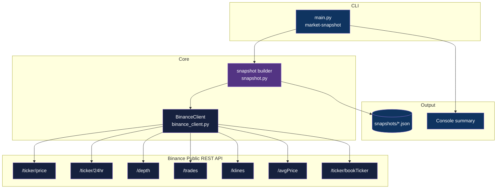

<div align="center">

# RATU REST API

[](https://www.python.org/downloads/)
[](https://github.com/astral-sh/uv)
[](LICENSE)
[](https://github.com/adityonugrohoid/ratu-template)
[](#)

**Comprehensive Binance market snapshots — price, depth, trade flow, and multi-timeframe klines via the public REST API. No auth required.**

[Getting Started](#getting-started) | [Architecture](#architecture) | [Usage](#usage) | [Notable Code](#notable-code)

</div>

---

> Part of the **RATU Project** (Real-time Automated Trading Unified) — system-prototyping focus on REST integration, dataclass-typed responses, and consolidated market analytics.

## Table of Contents

- [Features](#features)
- [Tech Stack](#tech-stack)
- [Architecture](#architecture)
- [Demo](#demo)
- [Getting Started](#getting-started)
- [Usage](#usage)
- [How It Works](#how-it-works)
- [Project Structure](#project-structure)
- [Notable Code](#notable-code)
- [Architectural Decisions](#architectural-decisions)
- [Testing](#testing)
- [Roadmap](#roadmap)
- [License](#license)
- [Author](#author)

## Features

- **Single-call market snapshot** — combines 7 Binance public endpoints (price, 24hr stats, depth, trades, klines × 3 timeframes, bookTicker, avgPrice) into one structured output
- **Order-book depth analysis** — top-20 bid/ask depth with bid/ask ratio and spread
- **Recent trade flow** — buy/sell breakdown across the last 100 trades
- **Multi-timeframe klines** — 1h / 4h / 1d candles for context spanning intraday → daily
- **No auth, no rate-limit headaches** — uses only public endpoints, no API key required
- **JSON snapshot files** — timestamped `snapshots/<symbol>_<ts>.json` for offline analysis

## Tech Stack

| Component | Technology |
|-----------|------------|
| Language | Python 3.10+ |
| Package manager | `uv` |
| HTTP client | `httpx` (sync, connection-pooled) |
| Data source | Binance Public REST API (`api.binance.com/api/v3/*`) |
| Models | `dataclass` response types |
| Output | JSON snapshots + console |
| Tests | `pytest`, `pytest-asyncio` |

## Architecture


```mermaid
graph TD
    subgraph CLI
        MAIN["main.py<br/>market-snapshot"]
    end

    subgraph Core
        SNAP["snapshot builder<br/>snapshot.py"]
        CLIENT["BinanceClient<br/>binance_client.py"]
    end

    subgraph "Binance Public REST API"
        PRICE["/ticker/price"]
        STATS["/ticker/24hr"]
        DEPTH["/depth"]
        TRADES["/trades"]
        KLINES["/klines"]
        AVG["/avgPrice"]
        BOOK["/ticker/bookTicker"]
    end

    subgraph Output
        JSON[("snapshots/*.json")]
        CONSOLE["Console summary"]
    end

    MAIN --> SNAP
    SNAP --> CLIENT
    CLIENT --> PRICE
    CLIENT --> STATS
    CLIENT --> DEPTH
    CLIENT --> TRADES
    CLIENT --> KLINES
    CLIENT --> AVG
    CLIENT --> BOOK
    SNAP --> JSON
    MAIN --> CONSOLE

    style MAIN fill:#0f3460,color:#fff
    style SNAP fill:#533483,color:#fff
    style CLIENT fill:#16213e,color:#fff
    style PRICE fill:#16213e,color:#fff
    style STATS fill:#16213e,color:#fff
    style DEPTH fill:#16213e,color:#fff
    style TRADES fill:#16213e,color:#fff
    style KLINES fill:#16213e,color:#fff
    style AVG fill:#16213e,color:#fff
    style BOOK fill:#16213e,color:#fff
    style JSON fill:#0f3460,color:#fff
    style CONSOLE fill:#0f3460,color:#fff
```

## Demo

### Snapshot summary — `uv run market-snapshot ETHUSDT`

```
================================================================================
  MARKET SNAPSHOT - ETHUSDT
================================================================================
  Symbol: ETHUSDT
  Price: $3,890.45
  24h Change: +45.20 (+1.18%)
  24h Range: $3,820.00 - $3,950.00
  24h Volume: 245,000.00 ETH
  24h Quote Volume: $952,000,000.00
  24h Trades: 1,250,000

  Order Book Depth (top 20 levels):
    Total Bid Depth: 125.5000
    Total Ask Depth: 118.2000
    Bid/Ask Ratio: 1.06

  Recent Trade Analysis (last 100):
    Buy Trades: 52 (52.0%)
    Sell Trades: 48 (48.0%)
    Buy/Sell Ratio: 1.08
    Avg Trade Size: 0.4500

  Spread: $0.0100 (0.0003%)

  Snapshot saved to: snapshots/ethusdt_*.json
```

### Snapshot JSON

```json
{
  "timestamp": "2025-12-12T17:00:00.000000",
  "symbol": "ETHUSDT",
  "summary": {
    "price": 3890.45,
    "price_change_24h": 45.20,
    "price_change_percent_24h": 1.18,
    "volume_24h": 245000.0,
    "trade_count_24h": 1250000
  },
  "depth_analysis": {
    "total_bid_depth": 125.5,
    "total_ask_depth": 118.2,
    "bid_ask_ratio": 1.06
  },
  "trade_analysis": {
    "buy_trades": 52,
    "sell_trades": 48,
    "buy_sell_ratio": 1.08
  }
}
```

## Getting Started

### Prerequisites

- Python 3.10+
- `uv` — see [install instructions](https://docs.astral.sh/uv/getting-started/installation/)
- No API key — Binance public endpoints are unauthenticated

### Installation

```bash
git clone https://github.com/adityonugrohoid/ratu-rest-api.git
cd ratu-rest-api
uv sync
```

### Configuration

```bash
cp .env.example .env
```

| Variable | Required | Default | Purpose |
|----------|----------|---------|---------|
| `LOG_LEVEL` | No | `INFO` | Python logging level |

## Usage

```bash
# Full snapshot — all 7 endpoints, console + JSON file
uv run market-snapshot ETHUSDT

# Basic info only — 24hr ticker + price, no file written
uv run market-snapshot ETHUSDT info

# Any USDT pair
uv run market-snapshot BTCUSDT
uv run market-snapshot SOLUSDT
```

## How It Works

### 1. Snapshot pipeline

`snapshot.py` walks `BinanceClient`'s seven public endpoints in sequence on the same connection pool, parses each response into a typed dataclass, then assembles the combined result:

| Section | Source endpoint(s) |
|---------|--------------------|
| Summary | `/ticker/24hr`, `/ticker/price`, `/avgPrice` |
| Order book | `/depth?limit=20` |
| Trade flow | `/trades?limit=100` |
| Klines | `/klines` × `1h`, `4h`, `1d` |
| Spread | `/ticker/bookTicker` |

### 2. Order-book depth aggregation

Sums `qty` across the top-20 bids and top-20 asks separately, then computes `bid/ask ratio` and absolute `spread = best_ask - best_bid`. The ratio is a quick directional bias indicator — values > 1 mean more depth supporting the price than resisting it.

### 3. Trade-flow classification

For the last 100 trades, splits by Binance's `isBuyerMaker` flag:

- `isBuyerMaker == false` → market buy (taker bought)
- `isBuyerMaker == true` → market sell (taker sold)

Reports both counts and a buy/sell ratio.

### 4. Snapshot file output

Snapshots write to `snapshots/<symbol>_<timestamp>.json` with full sub-section payloads — designed for offline backtesting, dashboards, or comparing two timestamps.

## Project Structure

```
ratu-rest-api/
├── src/rest_api/
│   ├── main.py             # CLI: market-snapshot entrypoint
│   ├── config.py           # API base URL, default symbols
│   ├── binance_client.py   # BinanceClient (httpx) + dataclass response types
│   └── snapshot.py         # 7-endpoint pipeline + JSON writer
├── tests/
│   ├── conftest.py
│   ├── test_config.py              # config validation
│   ├── test_binance_client.py      # client unit tests
│   └── test_binance_client_api.py  # live API contract checks
├── snapshots/              # JSON output (gitignored)
├── .env.example
├── pyproject.toml          # uv-managed, Python 3.10+
└── NOTABLE_CODE.md
```

## Notable Code

> See [NOTABLE_CODE.md](NOTABLE_CODE.md) for annotated walk-throughs of the multi-endpoint snapshot pipeline, dataclass response models, and connection-pooling setup.

## Architectural Decisions

### 1. Public endpoints only

**Decision:** Use exclusively unauthenticated Binance endpoints; no API-key support.

**Reasoning:** This tool is a market-analytics snapshot, not an order placer. Removing auth removes a class of secret-handling bugs and lets the repo run end-to-end in CI without any credential setup. Trade-off: cannot access account state or placed orders — out of scope.

### 2. Sequential calls on a pooled client

**Decision:** Walk the seven endpoints one after another on a single `httpx.Client`, not in parallel via async.

**Reasoning:** Total latency is dominated by Binance's per-endpoint response time, not Python's HTTP overhead. Pool reuse already eliminates TCP handshake cost. Sequential code is easier to read, reason about, and debug; async would buy ~100ms at the cost of materially more complexity.

### 3. Dataclass response models, not raw dicts

**Decision:** Every endpoint response is parsed into a typed dataclass before downstream code touches it.

**Reasoning:** The API returns numbers as strings; rolling that conversion into the dataclass `__post_init__` means downstream analytics never trip on string-vs-float arithmetic. Cost is ~50 lines of dataclass plumbing per response shape.

## Testing

```bash
uv run pytest tests/ -v
```

| Module | Coverage |
|--------|----------|
| `test_config.py` | Config defaults, base URL |
| `test_binance_client.py` | Client unit tests — request building, dataclass parsing |
| `test_binance_client_api.py` | Live API contract checks against Binance public endpoints |

## Roadmap

- [x] 7-endpoint single-call snapshot
- [x] Multi-timeframe klines (1h / 4h / 1d)
- [x] Trade flow classification
- [x] JSON snapshot persistence
- [ ] Snapshot diff / replay tooling
- [ ] WebSocket streaming snapshot variant
- [ ] Optional Bybit / OKX adapters behind same interface

## License

MIT — see [LICENSE](LICENSE).

## Author

**Adityo Nugroho** ([@adityonugrohoid](https://github.com/adityonugrohoid))
